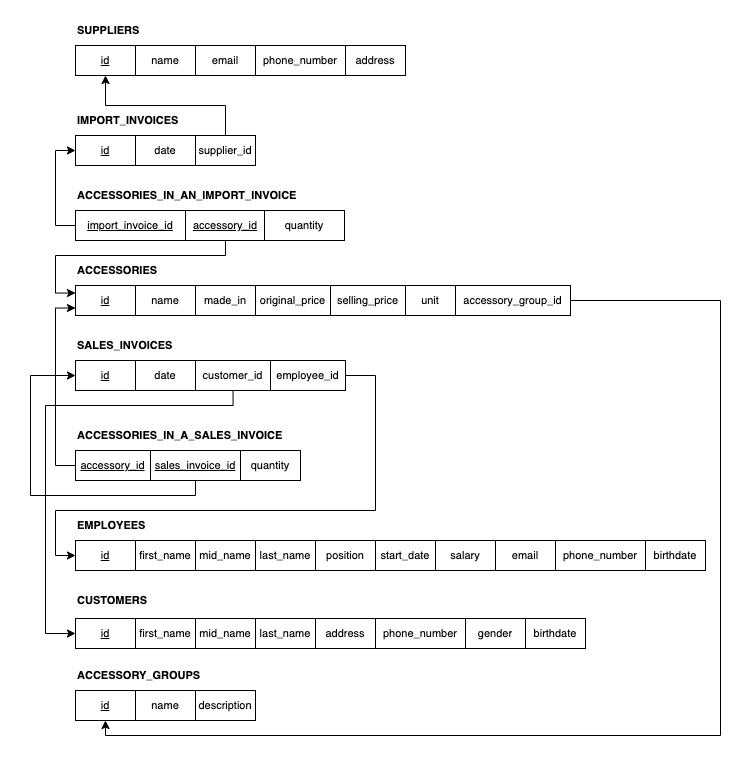

# Data Modeling for An Electronic Accessory Retail

The main objective of this project is to build a database for an electronic accessories store on Microsoft SQL Server. The project includes four key components: Entity Relationship Diagram (ERD), Relational Model of the electronic accessories store, implementation of the store's database on Microsoft SQL Server, and data querying. This project helps me gain a clear understanding of databases, master the techniques for building a database securely, and put them into practice effectively.

 

## Project Scope and Data Requirements

The project is based on a scenario involving an electronic components store - Hoang Lam Store - to construct a database for efficiently managing business information. The problem statement includes the following details:

Hoang Lam Store specializes in selling various electronic components. The store needs to store essential information about components such as name, code, specifications, country of origin, cost price, and selling price. Each component is categorized into a component group, including group code, name, and description.

Detailed information on component deliveries is recorded through delivery notes to track which components were received, quantities, delivery dates, and suppliers. Supplier information, including name, code, phone number, address, and email, is also stored for communication purposes.

Sales transactions are recorded through sales invoices to track sold components, quantities, and dates. If a customer purchases multiple components in one transaction, they are grouped onto a single invoice with a unique invoice number. The invoice should indicate the employee responsible for the transaction, considering the store has multiple shift workers.

Weekly sales reports (aggregated from sales invoices) are generated for each employee to determine appropriate bonus policies. To manage employees efficiently, each employee is assigned a unique employee code, and their details such as name, position, start date, hourly wage, date of birth, phone number, and email are stored.

Additionally, to create customer loyalty programs and manage customer relations, the store keeps records of customers who have made purchases, while visitors who do not make purchases are not logged. Customer information includes a minimum of customer code, name, gender, address, contact phone number, and birthday.

 

## Entity Relationship Diagram (ERD)

After analyzing the requirements, an ERD was designed to visually represent the database structure, facilitating efficient management of the electronic accessory store's business data.

<i>Entity Relationship Diagram - Source: Linh Pham My</i>

### Entity Types

Here is a breakdown of the entities and their corresponding attributes represented in the ERD:

1. **EMPLOYEES**:  This entity represents all employees working at the retail store.
   - **`id`**: A unique identifier for each employee.
   - **`name`**:  The name of the employee. It can be broken down to 3 components:
     - **`first`**: The first name of the employee.
     - **`mid`**: The middle name of the employee.
     - **`last`**: The last name of the employee.
   - **`position`**: The position that the employee holds within the company, e.g., "Manager", "Sales".
   - **`start_date`**:  The date when this employee started working at the company.
   - **`salary`**:  The salary of the employee.
   - **`email`**:  The email address of the employee.
   - **`phone`**: The phone number of the employee.
   - **`birth_date`**: The birth date of the employee.
 

2. **CUSTOMERS**:  This entity represents all customers who buy electronic accessories from the retail store.
   - **`id`**: A unique identifier for each customer.
   - **`name`**: Similar to `name` attribute in EMPLOYEES. It can also be broken down to 3 components:
     - **`first`**
     - **`mid`**
     - **`last`**
   - **`gender`**: Indicates whether the customer is male or female.
   - **`address`**: The full mailing address of the customer.
   - **`phone_number`**: The primary contact phone number for the customer.
   - **`birthdate`**: The birthday of the customer.
 

3. **ACCESSORIES**:  This entity represents all  electronic accessories that are sold by the retail store.
   - **`id`**: A unique identifier for each type of accessory.
   - **`name`**: The name of the accessory.
   - **`made_in`**: The country where the accessory was made.
   - **`unit`**: The unit price of one accessory item.
   - **`original_price`**: The original price of the accessory.
   - **`selling_price`**: The selling price of the accessory.
 

4. **ACCESSORY_GROUPS**: This entity groups multiple accessories together so they can be managed easily.
    - **`id`**: A unique identifier for each group.
    - **`name`**: The name of the group.
    - **`description`**: Description about what the group contains.
 

5. **SALES_INVOICES**: Represents a sale transaction between employees and customers, containing details such as which products were sold,
    - **`id`**: A unique identifier for the order.
    - **`date`**:The date when the order was placed.
 

6. **SUPPLIERS**: Represents suppliers who provide accessories for the retail store.
    - **`id`**: A unique identifier for each supplier.
    - **`name`**: The name of the supplier.
    - **`email`**:  The email address of the supplier.
    - **`phone_number`**:  The phone number of the supplier.
    - **`addrees`**: The address of the supplier.
 

7. **IMPORT_INVOICES**: Represents import invoices which contain information about imported items.
    - **`id`**: A unique identifier for each invoice.
    - **`date`**: The date when the invoice was issued.

> **Note**: The attributes which are <u>underlined</u> are primary keys.

### Relationships

In addition to the attributes of each individual entity, relationships between entities may possess their own set of attributes, contributing to a more nuanced understanding of the interconnected data within the system.

- **EMPLOYEES** and **SALES_INVOICES**: The relationship between employees and sales invoices is one-to-many, indicating that each employee can be associated with multiple sales invoices, while each sales invoice is tied to a single employee.
- **CUSTOMERS** and **SALES_INVOICES**: The relationship between customers and sales invoices is one-to-many, signifying that each customer can have multiple sales invoices, while each sales invoice is linked to a single customer.
- **ACCESSORIES** and **SALES_INVOICES**: The relationship between accessories and sales invoices is many-to-many, meaning that each sales invoice can contain multiple accessories, and each accessory can appear in multiple sales invoices. This relationship gives rise to an additional entity called **`quantity`**, which represents the quantity of each accessory sold in a particular sales invoice.
- **ACCESSORIES** and **ACCESSORY_GROUPS**: The relationship between accessories and accessory groups is many-to-one, indicating that multiple accessories can belong to a single accessory group, while each accessory group can encompass multiple accessories.
- **ACCESSORIES** and **IMPORT_INVOICES**: The relationship between accessories and import invoices is many-to-many, signifying that each import invoice can contain multiple accessories, and each accessory can be present in multiple import invoices. This relationship gives rise to an additional entity called **`quantity`**, which represents the quantity of each accessory imported in a particular import invoice.
- **IMPORT_INVOICES** and **SUPPLIERS**: The relationship between accessories and suppliers is many-to-one, indicating that multiple accessories can be supplied by a single supplier, while each accessory is sourced from only one supplier.

> **Note**: The attributes depicted in inconsistent-lined ovals within the ERD are not explicitly described, as they are derived attributes that can be calculated or inferred from other attributes within the entity or relationship. These attributes are not physically stored in the database but rather computed based on existing attribute values.

 

## Relational Model

After designing the ERD, I meticulously mapped the entities and their attributes into its relational model. The relational model diagram below provides a concise overview of the database structure, illustrating the relationships between tables through references, particularly via foreign keys. 

<i>Relational Model Diagram - Source: Linh Pham My</i>

The relational model diagram comprises nine tables representing various entities within the database schema. These entities include:

1. SUPPLIERS
2. IMPORT_INVOICES
3. ACCESSORIES_IN_AN_IMPORT_INVOICE
4. ACCESSORIES
5. SALES_INVOICES
6. ACCESSORIES_IN_A_SALES_INVOICE
7. EMPLOYEES
8. CUSTOMERS
9. ACCESSORY_GROUPS

Except for the tables **ACCESSORIES_IN_AN_IMPORT_INVOICE** and **ACCESSORIES_IN_A_SALES_INVOICE**, which are derived to capture the many-to-many relationships between **ACCESSORIES** and **IMPORT_INVOICES**, as well as **ACCESSORIES** and **SALES_INVOICES**, respectively, the other tables correspond to the seven entity types identified in the Entity-Relationship model.

The relational model diagram incorporates derived attributes from the relationships of the 7 entities, enriching the representation of the database structure and deepening understanding. For deeper insights into the mapping process from the Entity-Relationship model to the Relational model, [Mapping from ER Model to Relational Model](geeksforgeeks.org/mapping-from-er-model-to-relational-model/) offers valuable guidance and serves as a reference, elucidating underlying principles and methodologies.

 

## Table Structures

After mapping the entity relationship model to the relational model, I structured the database tables to accurately reflect the entities and their relationships. This process clarifies the database structure and the data types utilized within it, enhancing understanding of the database structure and its underlying relationships.

### 1. SUPPLIERS

| No. | Column Name  | Data Type     | Other Constraints     |
| --- | ------------ | ------------- | --------------------- |
| 1   | id           | CHAR(9)       | NOT NULL; Primary Key |
| 2   | name         | NVARCHAR(40)  | NOT NULL              |
| 3   | email        | NVARCHAR(50)  |                       |
| 4   | address      | NVARCHAR(100) |                       |
| 5   | phone_number | CHAR(10)      |                       |

### 2. IMPORT_INVOICES

| No. | Column Name | Data Type | Other Constraints                               |
| --- | ----------- | --------- | ----------------------------------------------- |
| 1   | id          | CHAR(5)   | NOT NULL; Primary Key                           |
| 2   | date        | DATE      | NOT NULL                                        |
| 3   | supplier_id | CHAR(9)   | NOT NULL; Foreign Key referencing **`SUPPLIERS(id)`** |

### 3. ACCESSORIES_IN_AN_IMPORT_INVOICE

| No. | Column Name       | Data Type | Other Constraints                                                  |
| --- | ----------------- | --------- | ------------------------------------------------------------------ |
| 1   | import_invoice_id | CHAR(5)   | NOT NULL; Primary Key; Foreign Key referencing **`IMPORT_INVOICES(id)`** |
| 2   | accessory_id      | CHAR(5)   | NOT NULL; Primary Key; Foreign Key referencing **`ACCESSORIES(id)`**     |
| 3   | quantity          | INT       | NOT NULL; Only accepts non-negative values (>= 0)                  |

### 4. ACCESSORIES

| No. | Column Name    | Data Type    | Other Constraints                                      |
| --- | -------------- | ------------ | ------------------------------------------------------ |
| 1   | id             | CHAR(5)      | NOT NULL; Primary Key                                  |
| 2   | name           | NVARCHAR(50) | NOT NULL                                               |
| 3   | made_in        | NVARCHAR(20) |                                                        |
| 4   | unit           | NVARCHAR(20) | NOT NULL                                               |
| 5   | original_price | NUMERIC(8,0) | NOT NULL; Only accepts non-negative values (>= 0)      |
| 6   | selling_price  | NUMERIC(8,0) | NOT NULL; Only accepts non-negative values (>= 0)      |
| 7   | accessory_group_id   | CHAR(5)      | NOT NULL; Foreign Key referencing **`ACCESSORY_GROUPS(id)`** |

### 5. SALES_INVOICES

| No. | Column Name | Data Type | Other Constraints                               |
| --- | ----------- | --------- | ----------------------------------------------- |
| 1   | id          | CHAR(9)   | NOT NULL; Primary Key                           |
| 2   | date        | DATE      | NOT NULL                                        |
| 3   | customer_id | CHAR(9)   | NOT NULL; Foreign Key referencing **`CUSTOMERS(id)`** |
| 4   | employee_id | CHAR(4)   | NOT NULL; Foreign Key referencing **`EMPLOYEES(id)`** |

### 6. ACCESSORIES_IN_A_SALES_INVOICE

| No. | Column Name      | Data Type | Other Constraints                                                 |
| --- | ---------------- | --------- | ----------------------------------------------------------------- |
| 1   | sales_invoice_id | CHAR(9)   | NOT NULL; Primary Key; Foreign Key referencing **`SALES_INVOICES(id)`** |
| 2   | accessory_id     | CHAR(5)   | NOT NULL; Primary Key; Foreign Key referencing **`ACCESSORIES(id)`**    |
| 3   | quantity         | INT       | NOT NULL; Only accepts non-negative values (>= 0)                 |

### 7. EMPLOYEES

| No. | Column Name  | Data Type    | Other Constraints                                 |
| --- | ------------ | ------------ | ------------------------------------------------- |
| 1   | id           | CHAR(4)      | NOT NULL; Primary Key                             |
| 2   | last_name    | NVARCHAR(20) | NOT NULL                                          |
| 3   | mid_name     | NVARCHAR(20) | NOT NULL                                          |
| 4   | first_name   | NVARCHAR(20) | NOT NULL                                          |
| 5   | position     | NVARCHAR(20) | NOT NULL                                          |
| 6   | start_date   | DATE         | NOT NULL                                          |
| 7   | salary       | NUMERIC(8,0) | NOT NULL; Only accepts non-negative values (>= 0) |
| 8   | email        | NVARCHAR(50) |                                                   |
| 9   | phone_number | CHAR(10)     |                                                   |
| 10  | birthdate    | DATE         |                                                   |

### 8. CUSTOMERS

| No. | Column Name  | Data Type     | Other Constraints                                    |
| --- | ------------ | ------------- | ---------------------------------------------------- |
| 1   | id           | Char(9)       | NOT NULL; Primary Key                                |
| 2   | first_name   | NVARCHAR(20)  |                                                      |
| 3   | mid_name     | NVARCHAR(30)  | NOT NULL                                             |
| 4   | last_name    | NVARCHAR(20)  | NOT NULL                                             |
| 5   | address      | NVARCHAR(100) |                                                      |
| 6   | phone_number | CHAR(10)      |                                                      |
| 7   | gender       | NVARCHAR(3)   | NOT NULL; Only accepts values **Male** or **Female** |
| 8   | birthdate    | DATE          |                                                      |

### 9. ACCESSORY_GROUPS

| No. | Column Name | Data Type    | Other Constraints     |
| --- | ----------- | ------------ | --------------------- |
| 1   | id          | CHAR(5)      | NOT NULL; Primary key |
| 2   | name        | NVARCHAR(20) | NOT NULL              |
| 3   | description | TEXT         | NOT NULL              |

 

## SQL Time!

### 1. Create Tables

Before embarking on any data operations, the foundational step involves creating a robust database structure, starting with the creation of tables. The **`create_tables.sql`** file provided [here](SQL/create_tables.sql) lays out the essential SQL commands required to define and establish the necessary tables within the database schema.

### 2. Add Foreign Key Constraints

Although the **`create_tables.sql`** file sets up the basic database structure, additional steps are necessary to ensure data integrity and relational consistency. Execute the **`add_foreign_keys.sql`** file [here](SQL/add_foreign_keys.sql) after creating the tables to enforce foreign key constraints and enhance the database's robustness.

### 3. Data Input

The data input for the project is stored as CSV files in [this directory](data). However, because of the requirements of the project, I have to write SQL statements to input the data table by table, line by line. The `insert_data.sql` file is [here](SQL/insert_data.sql). The input order is correct. Data of a latter table should not be imported first as the error about constraints (especially foreign key constraints) will be raised. 

The data input is fake and it is in Vietnamese.

### 4. Queries

In fulfilling the project requirements, this section presents a series of SQL queries designed to extract meaningful insights and data from the established database structure. These queries are crafted to demonstrate various levels of complexity, ranging from simple conditions to compound queries involving multiple conditions and relations. Each query serves as a testament to the database's functionality and the proficiency in leveraging SQL to extract valuable information.

All the queries lie in [this file](SQL/queries.sql). They better be executed one by one to view the result of each. Otherwise, the result set is of the last one.

#### Query 1

**Requirement:** Retrieve the code number and name of sales employees, along with the number of invoices each person has executed.
**Result:**
[Query 1 result]()

<i>Query 1 result - Source: Linh Pham My</i>

#### Query 2

**Requirement:**
**Result:**
[Query 2 result]()

<i>Query 2 result - Source: Linh Pham My</i>

#### Query 3

**Requirement:**
**Result:**
[Query 3 result]()

<i>Query 3 result - Source: Linh Pham My</i>

#### Query 4

**Requirement:**
**Result:**
[Query 4 result]()

<i>Query 4 result - Source: Linh Pham My</i>

#### Query 5

**Requirement:**
**Result:**
[Query 5 result]()

<i>Query 5 result - Source: Linh Pham My</i>

 

## Conclusion

