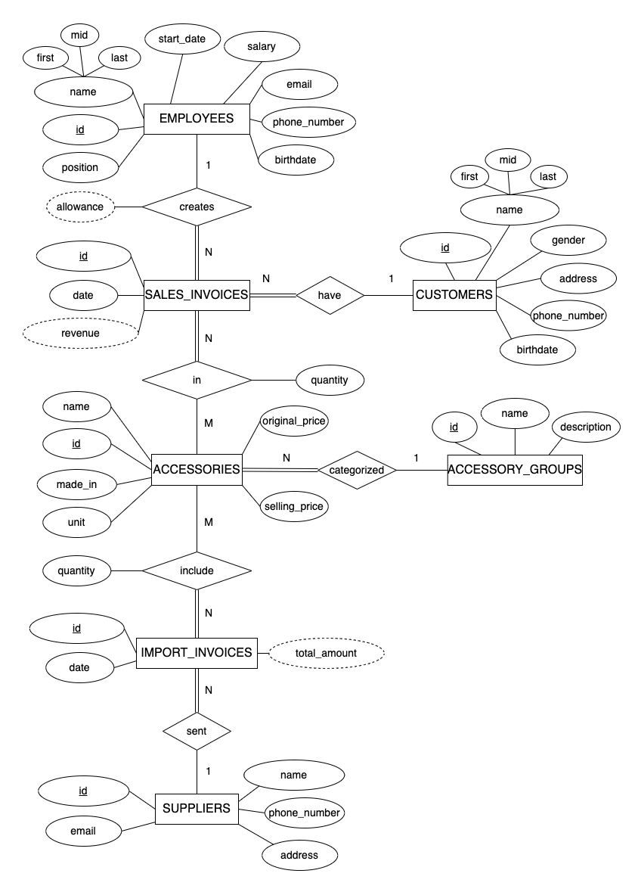

# Data Modeling for An Electronic Accessory Retail

The main objective of this project is to build a database for an electronic accessories store on Microsoft SQL Server. The project includes four key components: Entity Relationship Diagram (ERD), Relational Model of the electronic accessories store, implementation of the store's database on Microsoft SQL Server, and data querying. This project helps me gain a clear understanding of databases, master the techniques for building a database securely, and put them into practice effectively.

 

## Project Scope and Data Requirements

The project is based on a scenario involving an electronic components store - Hoang Lam Store - to construct a database for efficiently managing business information. The problem statement includes the following details:

Hoang Lam Store specializes in selling various electronic components. The store needs to store essential information about components such as name, code, specifications, country of origin, cost price, and selling price. Each component is categorized into a component group, including group code, name, and description.

Detailed information on component deliveries is recorded through delivery notes to track which components were received, quantities, delivery dates, and suppliers. Supplier information, including name, code, phone number, address, and email, is also stored for communication purposes.

Sales transactions are recorded through sales invoices to track sold components, quantities, and dates. If a customer purchases multiple components in one transaction, they are grouped onto a single invoice with a unique invoice number. The invoice should indicate the employee responsible for the transaction, considering the store has multiple shift workers.

Weekly sales reports (aggregated from sales invoices) are generated for each employee to determine appropriate bonus policies. To manage employees efficiently, each employee is assigned a unique employee code, and their details such as name, position, start date, hourly wage, date of birth, phone number, and email are stored.

Additionally, to create customer loyalty programs and manage customer relations, the store keeps records of customers who have made purchases, while visitors who do not make purchases are not logged. Customer information includes a minimum of customer code, name, gender, address, contact phone number, and birthday.

 

## Entity Relationship Diagram (ERD)

After analyzing the requirements, an ERD was designed to visually represent the database structure, facilitating efficient management of the electronic accessory store's business data.

Here is a breakdown of the entities and their corresponding attributes represented in the ERD:

1. **EMPLOYEES**:  This entity represents all employees working at the retail store.
   - **`id`**: A unique identifier for each employee.
   - **`name`**:  The name of the employee. It can be broken down to 3 components:
     - **`first`**: The first name of the employee.
     - **`mid`**: The middle name of the employee.
     - **`last`**: The last name of the employee.
   - **`start_date`**:  The date when this employee started working at the company.
   - **`salary`**:  The salary of the employee.
   - **`email`**:  The email address of the employee.
   - **`phone`**: The phone number of the employee.
   - **`birth_date`**: The birth date of the employee.
 

2. **CUSTOMERS**:  This entity represents all customers who buy electronic accessories from the retail store.
   - **`id`**: A unique identifier for each customer.
   - **`name`**: Similar to `name` attribute in EMPLOYEES. It can also be broken down to 3 components:
     - **`first`**
     - **`mid`**
     - **`last`**
   - **`gender`**:  Indicates whether the customer is male or female.
   - address:
   - birthdate